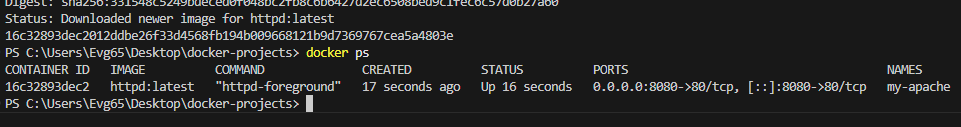
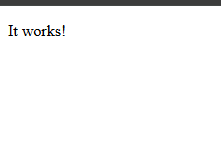
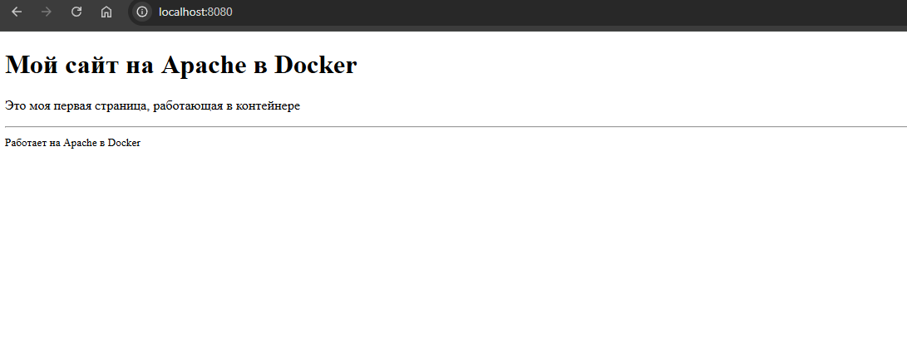

# Мои Docker-проекты

Этот репозиторий содержит мои работы по изучению Docker. Здесь собраны отчеты о запуске различных сервисов в контейнерах с пошаговыми инструкциями и скриншотами.

---

## 📋 Выполненные задания

| № | Задание | Описание | Отчет |
|---|---------|----------|-------|
| 1 | **Apache HTTP Server** | Запуск веб-сервера Apache в Docker, проброс портов, монтирование локальной папки с сайтом | [Apache.md](myNotes/Apache.md) |

---

## 🐳 Демонстрация работы Apache

### Контейнер запущен и работает

```bash
docker ps
```



---

### Страница Apache по умолчанию

При первом запуске открывается стандартная страница "It works!":



---

### Кастомная страница после монтирования

После подключения локальной папки с собственным `index.html` страница изменилась:



---

## 📁 Структура репозитория

```
docker-projects/
│
├── myNotes/                    # Папка с отчетами
│   └── Apache.md               # Отчет по Apache
│
├── screenshots/                # Папка со скриншотами
│   ├── docker-ps.png           # Скриншот docker ps
│   ├── apache-default.png      # Стандартная страница Apache
│   └── apache-custom.png       # Кастомная страница
│
├── website/                    # Папка с веб-сайтом
│   └── index.html              # Главная страница сайта
│
└── README.md                   # Этот файл
```

---

## 🚀 Как запустить Apache (инструкция)

### 1. Запуск контейнера

```bash
docker run -d --name my-apache -p 8080:80 httpd:latest
```

### 2. Проверка, что контейнер работает

```bash
docker ps
```

### 3. Открыть в браузере

```
http://localhost:8080
```

### 4. Остановка и удаление контейнера

```bash
docker stop my-apache
docker rm my-apache
```

### 5. Запуск с монтированием локальной папки (для своего сайта)

```bash
docker run -d --name my-apache -p 8080:80 -v C:\Users\Evg65\Desktop\docker-projects\website:/usr/local/apache2/htdocs/ httpd:latest
```

---

## 📝 Содержимое кастомной страницы (`website/index.html`)

```html
<!DOCTYPE html>
<html>
<head>
    <meta charset="UTF-8">
    <title>Мой сайт на Docker</title>
</head>
<body>
    <h1>Мой сайт на Apache в Docker</h1>
    <p>Это моя первая страница, работающая в контейнере</p>
    <hr>
    <small>Работает на Apache в Docker</small>
</body>
</html>
```

---

## 🔧 Полезные команды Docker

| Команда | Описание |
|---------|----------|
| `docker ps` | Показать запущенные контейнеры |
| `docker ps -a` | Показать все контейнеры (включая остановленные) |
| `docker stop <name>` | Остановить контейнер |
| `docker start <name>` | Запустить остановленный контейнер |
| `docker rm <name>` | Удалить контейнер |
| `docker rm -f <name>` | Принудительно удалить контейнер |
| `docker logs <name>` | Посмотреть логи контейнера |
| `docker exec -it <name> bash` | Зайти внутрь контейнера |
| `docker exec <name> ls /usr/local/apache2/htdocs/` | Проверить файлы в контейнере |

---

## 📊 Вывод

Я успешно:
- ✅ Установил и запустил Docker
- ✅ Запустил контейнер с Apache HTTP Server
- ✅ Настроил проброс портов (8080 → 80)
- ✅ Создал собственную веб-страницу
- ✅ Примонтировал локальную папку к контейнеру
- ✅ Оформил отчет с пошаговой инструкцией и скриншотами
- ✅ Выложил всё в GitHub

Docker позволяет быстро разворачивать сервисы без установки на основную систему.

---

*Репозиторий обновляется по мере выполнения новых заданий.*
```

---

Этот README.md теперь содержит:
- Все скриншоты с правильными ссылками
- Полную инструкцию по запуску
- Содержимое кастомной страницы
- Таблицу полезных команд
- Вывод о проделанной работе

Копируйте этот код в файл `README.md` в корне вашего репозитория и сохраняйте.
