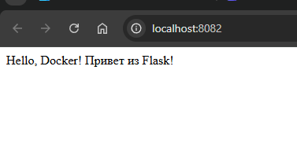

# Задание 1: Flask + Python в Docker

## Описание
Веб-приложение на Flask, запущенное в Docker контейнере.

## Файлы проекта
- `app.py` - код приложения
- `requirements.txt` - зависимости
- `Dockerfile` - инструкции для сборки

## Команды

### Сборка образа
```bash
docker build -t my-flask-app .
```

### Запуск контейнера
```bash
docker run -d --name my-flask-container -p 8082:5000 my-flask-app
```

### Проверка
Открыть в браузере: http://localhost:8082

## Скриншот


---
*Выполнено: Евгений*
