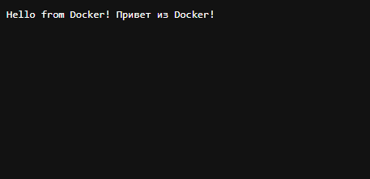

# Задание 2: C# .NET в Docker

## Описание
Веб-приложение на ASP.NET Core, запущенное в Docker контейнере.

## Файлы проекта
- `Program.cs` - код приложения
- `MyApp.csproj` - файл проекта
- `Dockerfile` - инструкции для сборки

## Команды

### Сборка образа
```bash
docker build -t my-dotnet-app .
```

### Запуск контейнера
```bash
docker run -d --name my-dotnet-container -p 8081:80 my-dotnet-app
```

### Проверка
Открыть в браузере: http://localhost:8081

## Скриншот


---
*Выполнено: Евгений*
