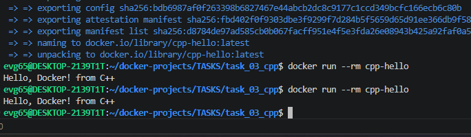

# Задание 3: C++ Console в Docker

## Описание
Консольное приложение на C++, которое выводит "Hello, Docker! from C++"

## Файлы проекта
- `hello.cpp` - исходный код
- `Dockerfile` - двухэтапная сборка (gcc → alpine)

## Команды

### Сборка образа
```bash
docker build -t cpp-hello .
```

### Запуск контейнера
```bash
docker run --rm cpp-hello
```

### Войти в контейнер для исследования
```bash
docker run -it --entrypoint sh cpp-hello
```

## Скриншот


---
*Выполнено: Евгений*
