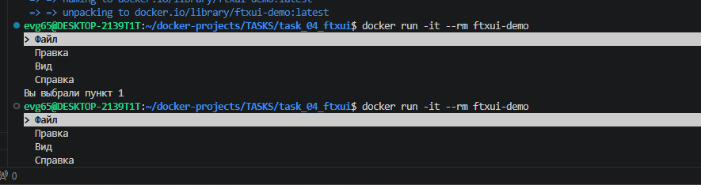

# Задание 4: C++ FTXUI в Docker

## Описание
Консольное приложение с меню на C++ с использованием библиотеки FTXUI.

## Файлы проекта
- `main.cpp` - исходный код с меню
- `CMakeLists.txt` - сборка через CMake
- `Dockerfile` - двухэтапная сборка

## Команды

### Сборка образа
```bash
docker build -t ftxui-demo .
```

### Запуск контейнера
```bash
docker run -it --rm ftxui-demo
```

### Войти в контейнер для исследования
```bash
docker run -it --entrypoint bash ftxui-demo
```

## Скриншот


---
*Выполнено: Евгений*
