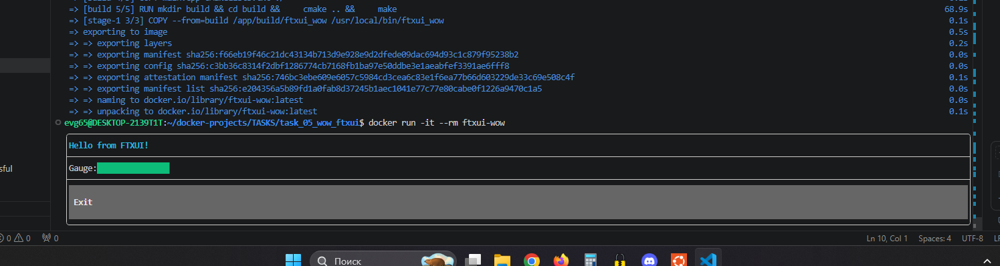

# Задание 5: Wow - консольное псевдографическое приложение на C++ и FTXUI

## Описание
Консольное приложение с анимированным gauge (индикатором прогресса) на C++ с использованием библиотеки FTXUI.

## Файлы проекта
- `main.cpp` - исходный код с анимацией
- `CMakeLists.txt` - сборка через CMake
- `Dockerfile` - двухэтапная сборка

## Команды

### Сборка образа
```bash
docker build -t ftxui-wow .
```

### Запуск контейнера
```bash
docker run -it --rm ftxui-wow
```

### Войти в контейнер для исследования
```bash
docker run -it --entrypoint bash ftxui-wow
```

## Скриншот


---
*Выполнено: Евгений*
