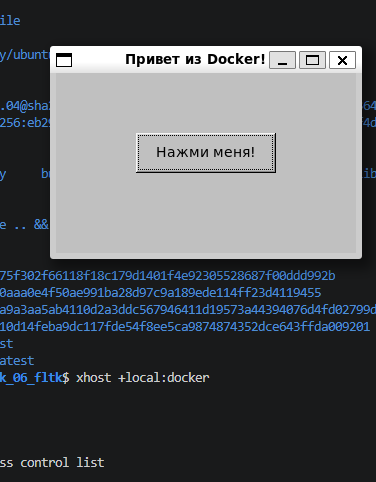

# Задание 6: Оконное приложение на C++ и FLTK

## Описание
Графическое приложение с окном и кнопкой на C++ с использованием библиотеки FLTK.

## Файлы проекта
- `main.cpp` - исходный код с окном и кнопкой
- `CMakeLists.txt` - сборка через CMake
- `Dockerfile` - установка FLTK и сборка

## Команды

### Сборка образа
```bash
docker build -t fltk-demo .
```

### Запуск контейнера (WSL 2.0)
```bash
xhost +local:docker
docker run -it --rm \
  -e DISPLAY=$DISPLAY \
  -v /tmp/.X11-unix:/tmp/.X11-unix:rw \
  fltk-demo
```

### Войти в контейнер для исследования
```bash
docker run -it --entrypoint bash fltk-demo
```

## Скриншот


---
*Выполнено: Евгений*
