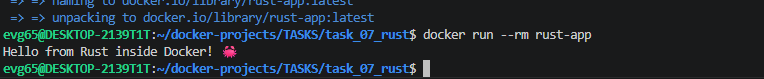

# Задание 7: Приложение на Rust

## Описание
Консольное приложение на Rust, которое выводит "Hello from Rust inside Docker! 🦀"

## Файлы проекта
- `src/main.rs` - исходный код
- `Cargo.toml` - конфигурация проекта
- `Dockerfile` - двухэтапная сборка

## Команды

### Сборка образа
```bash
docker build -t rust-app .
```

### Запуск контейнера
```bash
docker run -it --rm rust-app
```

### Войти в контейнер для исследования
```bash
docker run -it --rm --entrypoint sh rust-app
./rust-app
```

## Скриншот


---
*Выполнено: Евгений*
