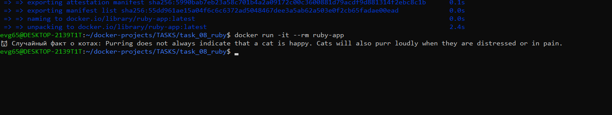

# Задание 8: Приложение на Ruby

## Описание
Консольное приложение на Ruby, которое получает случайный факт о котах с API catfact.ninja

## Файлы проекта
- `app.rb` - исходный код
- `Gemfile` - зависимости (httparty)
- `Dockerfile` - сборка образа

## Команды

### Сборка образа
```bash
docker build -t ruby-app .
```

### Запуск контейнера
```bash
docker run -it --rm ruby-app
```

## Скриншот


---
*Выполнено: Евгений*
