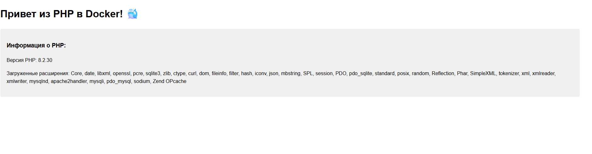

# Задание 9: Приложение на PHP

## Описание
Веб-приложение на PHP с Apache, отображающее информацию о версии PHP и загруженных расширениях.

## Файлы проекта
- `src/index.php` - PHP скрипт
- `Dockerfile` - образ с PHP и Apache

## Команды

### Сборка образа
```bash
docker build -t php-app .
```

### Запуск контейнера
```bash
docker run -d -p 8081:80 --name my-php-app php-app
```

### Проверка
Открыть в браузере: http://localhost:8081

### Остановка
```bash
docker stop my-php-app
docker rm my-php-app
```

## Скриншот


---
*Выполнено: Евгений*
