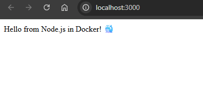

# Задание 10: Node.JS

## Описание
Веб-сервер на Node.js с Express, который возвращает "Hello from Node.js in Docker! 🐳"

## Файлы проекта
- `app.js` - код приложения (Express)
- `package.json` - зависимости
- `Dockerfile` - сборка образа

## Команды

### Сборка образа
```bash
docker build -t my-node-app .
```

### Запуск контейнера
```bash
docker run -d -p 3000:3000 --name my-node-app my-node-app
```

### Проверка
Открыть в браузере: http://localhost:3000

### Остановка
```bash
docker stop my-node-app
docker rm my-node-app
```

## Скриншот


---
*Выполнено: Евгений*
