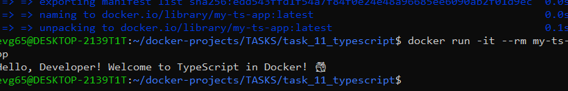

# Задание 11: Приложение на TypeScript

## Описание
Консольное приложение на TypeScript, которое компилируется в JavaScript и запускается в Docker.

## Файлы проекта
- `src/index.ts` - исходный код на TypeScript
- `package.json` - зависимости
- `tsconfig.json` - настройки компилятора
- `Dockerfile` - двухэтапная сборка

## Команды

### Сборка образа
```bash
docker build -t my-ts-app .
```

### Запуск контейнера
```bash
docker run -it --rm my-ts-app
```

## Скриншот


---
*Выполнено: Евгений*
