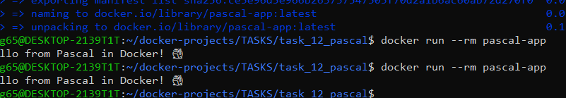

# Задание 12: Приложение на Pascal

## Описание
Консольное приложение на Pascal, которое выводит "Hello from Pascal in Docker! 🐳"

## Файлы проекта
- `hello.pas` - исходный код на Pascal
- `Dockerfile` - сборка образа с Free Pascal

## Команды

### Сборка образа
```bash
docker build -t pascal-app .
```

### Запуск контейнера
```bash
docker run --rm pascal-app
```

## Скриншот


---
*Выполнено: Евгений*
