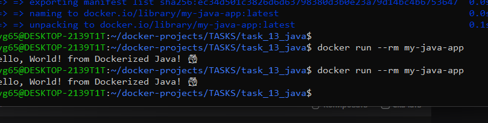

# Задание 16: Java приложение

## Описание
Консольное приложение на Java, собранное с помощью Maven, запущенное в Docker.

## Файлы проекта
- `src/main/java/com/example/MyApp.java` - исходный код
- `pom.xml` - конфигурация Maven
- `Dockerfile` - двухэтапная сборка

## Команды

### Сборка образа
```bash
docker build -t my-java-app .
```

### Запуск контейнера
```bash
docker run --rm my-java-app
```

## Скриншот


---
*Выполнено: Евгений*
