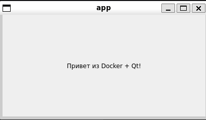

# Задание 17: Qt5/C++ приложение

## Описание
Графическое приложение на Qt5 с окном и надписью "Привет из Docker + Qt!"

## Файлы проекта
- `main.cpp` - исходный код на C++/Qt
- `CMakeLists.txt` - сборка через CMake
- `Dockerfile` - образ с Qt5
- `run.sh` - скрипт запуска с графикой

## Команды

### Сборка образа
```bash
docker build -t qt-docker-app .
```

### Запуск (Linux/WSL)
```bash
chmod +x run.sh
./run.sh
```

## Скриншот


---
*Выполнено: Евгений*
