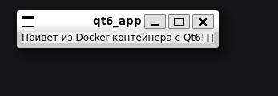

# Задание 18: Qt6/C++ приложение

## Описание
Графическое приложение на Qt6 с окном и надписью "Привет из Docker-контейнера с Qt6! 🐳"

## Файлы проекта
- `main.cpp` - исходный код на C++/Qt6
- `CMakeLists.txt` - сборка через CMake
- `Dockerfile` - образ с Qt6

## Команды

### Сборка образа
```bash
docker build -t qt6-app .
```

### Запуск (Linux/WSL)
```bash
docker run -it --rm \
  -e DISPLAY=$DISPLAY \
  -v /tmp/.X11-unix:/tmp/.X11-unix:rw \
  qt6-app
```

## Скриншот


---
*Выполнено: Евгений*
