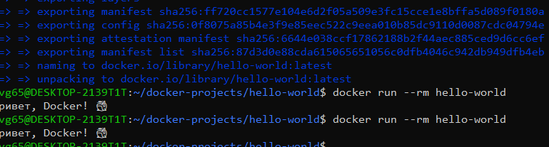

# Hello-world в Docker

## Описание
Минимальный Docker-контейнер на Alpine Linux, который выводит "Привет, Docker! 🐳"

## Команды

### Сборка образа
```bash
docker build -t hello-world .
```

### Запуск контейнера
```bash
docker run --rm hello-world
```

## Результат
```
Привет, Docker! 🐳
```

## Скриншот


---
*Выполнено: Евгений*
