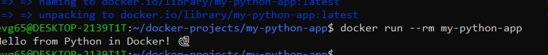

# Простое приложение на Python в Docker

## Описание
Консольное приложение на Python, которое выводит "Hello from Python in Docker! 🐍"

## Команды

### Сборка образа
```bash
docker build -t my-python-app .
```

### Запуск контейнера
```bash
docker run --rm my-python-app
```

## Скриншот


---
*Выполнено: Евгений*
