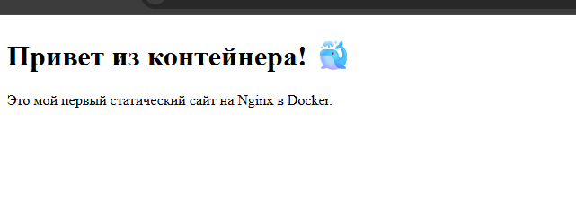

# Статический сайт на Nginx в Docker

## Описание
Веб-сервер Nginx с простой HTML-страницей.

## Команды

### Сборка образа
```bash
docker build -t my-site .
```

### Запуск контейнера
```bash
docker run -d -p 8081:80 --name my-site -v $(pwd):/usr/share/nginx/html my-site
```

### Проверка
Открыть в браузере: http://localhost:8081

## Скриншот


---
*Выполнено: Евгений*
