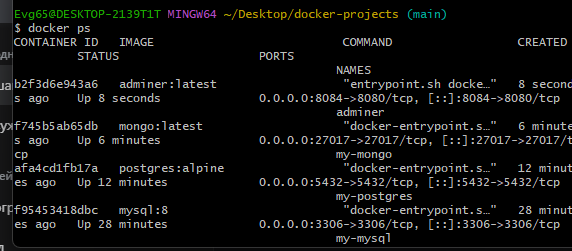
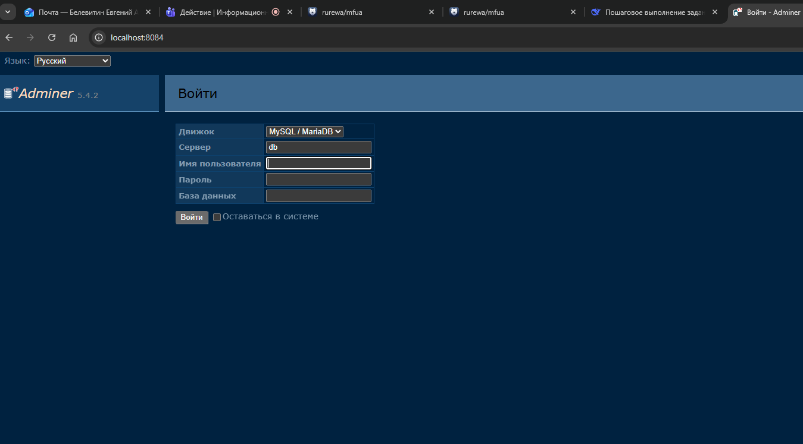
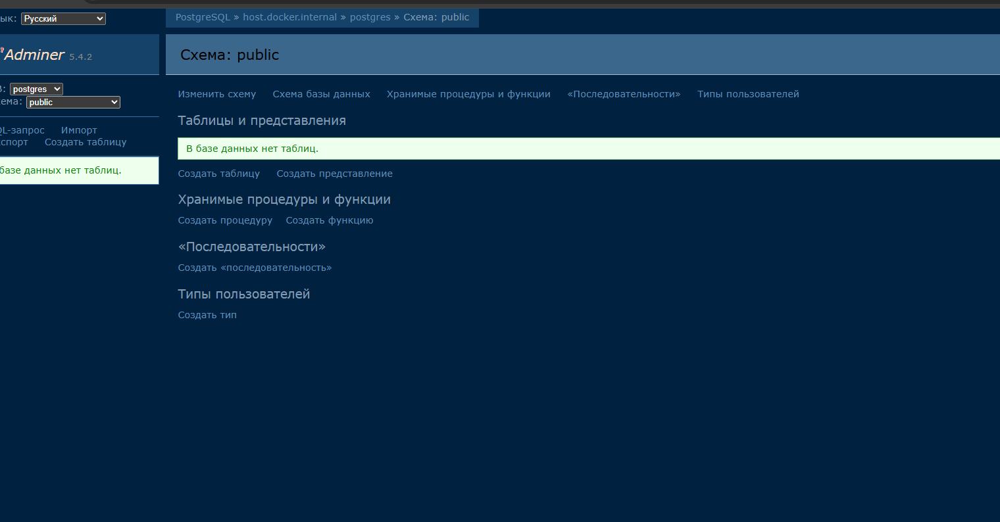

# Задание №9: Adminer

## Цель работы
Запустить Adminer (веб-интерфейс для управления базами данных)

## Выполнение

### 1. Запуск контейнера
docker run -d
--name adminer
-p 8084:8080
adminer:latest

text

### 2. Проверка работы
docker ps

text

### 3. Открытие в браузере
http://localhost:8084

### 4. Форма входа

## Возможности Adminer

- Поддержка MySQL, PostgreSQL, SQLite, MongoDB
- Управление базами данных, таблицами, индексами
- Выполнение SQL запросов
- Экспорт/импорт данных

## Вывод
Adminer запущен и доступен по адресу http://localhost:8084
📝 Обнови главный README.md
Добавь в таблицу:

markdown
| 9 | Adminer | Веб-интерфейс для управления БД | [Adminer.md](myNotes/Adminer/README.md) |
