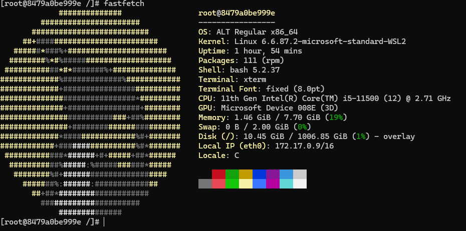

# Отчёт: Работа с российским дистрибутивом Alt Linux в Docker

## 1. Запуск Alt Linux: встреча с Sisyphus

Для тестирования был развёрнут контейнер на базе российского дистрибутива Alt Linux — выбрана ветка `sisyphus`. Это нестабильная ветка для разработчиков: она содержит самые свежие пакеты, но может быть менее стабильной, чем релизные версии.

Команда запуска контейнера:

`docker run -ti --rm --name alt alt:sisyphus /bin/bash`

Ключевые параметры:
* `-ti` — интерактивный режим с доступом к терминалу;
* `--rm` — автоматическое удаление контейнера после завершения работы (чистота окружения без лишних действий);
* `--name alt` — присвоение понятного имени контейнеру;
* `/bin/bash` — запуск оболочки Bash сразу после старта контейнера.

## 2. Установка ПО: проверка менеджера пакетов

В рамках демонстрации работоспособности репозиториев Sisyphus была выполнена установка утилиты `fastfetch` — современного аналога `neofetch`, который отображает информацию о системе в красивом формате.

Последовательность действий:
1. Обновление списка пакетов:
   ```bash
   apt-get update
   ```
2. Установка утилиты `fastfetch`:
   ```bash
   apt-get install -y fastfetch
   ```

### Результат работы fastfetch в Alt Linux

После установки была запущена утилита `fastfetch`. Она успешно определила и отобразила ключевые параметры системы внутри контейнера: версию ОС, ядро, окружение и т. д.



## 3. Вывод: итоги тестирования

Тестирование показало, что:
* образ Alt Linux `sisyphus` успешно загружается и запускается в Docker;
* менеджер пакетов `apt-get` корректно взаимодействует с репозиториями Sisyphus — обновление списка пакетов и установка ПО прошли без ошибок;
* установленные утилиты (на примере `fastfetch`) работают штатно и предоставляют достоверную информацию о системе;
* среда готова к дальнейшему использованию для разработки, тестирования или изучения особенностей российского дистрибутива.

**Итог:** Alt Linux в Docker — рабочий инструмент для разработчиков и администраторов, позволяющий быстро развернуть отечественную ОС в изолированной среде для решения различных задач.
```

Хотите, добавлю раздел с примерами настройки сети, монтирования томов или покажу, как сохранить изменённый контейнер в новый образ?
