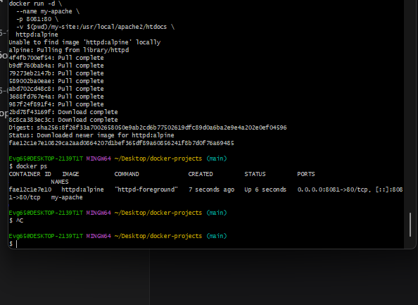
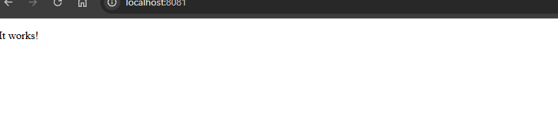
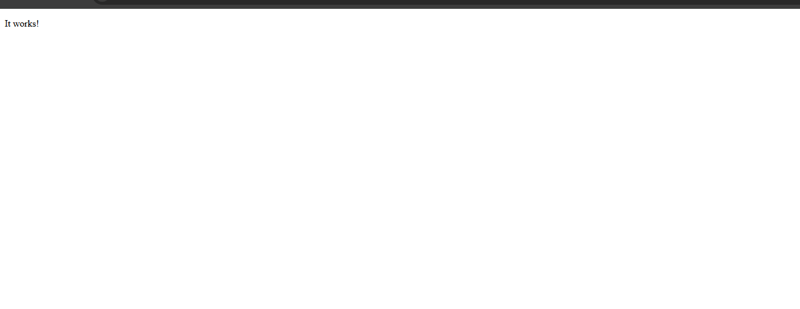

Держи готовый код с правильными путями для `myNotes/ApacheStaticSite/README.md`:

```markdown
# Задание №12: Статический сайт на Apache

## Цель работы
Запустить Apache с монтированием локальной папки для статического сайта

## Выполнение

### 1. Создание HTML файла
```bash
mkdir -p my-site
echo '<!DOCTYPE html>
<html>
<head>
    <meta charset="UTF-8">
    <title>Мой сайт на Apache</title>
</head>
<body>
    <h1>Привет, Docker!</h1>
    <p>Это мой статический сайт, работающий в контейнере Apache</p>
</body>
</html>' > my-site/index.html
```

### 2. Запуск контейнера
```bash
docker run -d \
  --name my-apache \
  -p 8081:80 \
  -v $(pwd)/my-site:/usr/local/apache2/htdocs \
  httpd:alpine
```

### 3. Проверка работы
```bash
docker ps
```



### 4. Открытие в браузере
http://localhost:8081



### 5. Обновление сайта
```bash
echo '<h1>Обновленный сайт на Docker!</h1>' > my-site/index.html
```



## Вывод
Apache с статическим сайтом запущен и доступен по адресу http://localhost:8081
```

## 🚀 Отправь на GitHub:

```bash
cd ~/Desktop/docker-projects
git add myNotes/ApacheStaticSite/README.md
git add screenshots/apache-static/
git commit -m "fix apache static site paths"
git push
```

---

**Пиши "погнали к тринадцатому"** 🚀