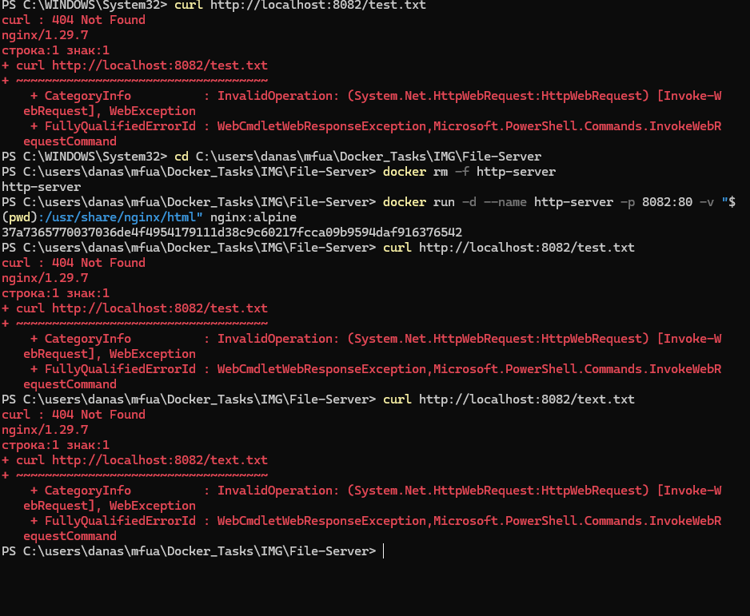

# Отчёт: Приключения HTTP‑сервера — как мы чуть не отдали System32 всему интернету

## 1. Описание задачи

Цель была простой и благородной: настроить контейнер Nginx, чтобы он раздавал скромный статический файл `test.txt` на порту 8082. Для этого планировалось использовать монтирование локальной директории — классика жанра!

## 2. Ход работы и эпические провалы

Путь к успеху оказался тернист и полон сюрпризов. Разберём все казусы по порядку — с юмором, но без потери сути.

### Проблема № 1: «А где файл?» или Ошибка 404 Not Found

**Симптомы:**
Выполняем `curl http://localhost:8082/test.txt`, а в ответ — холодный и равнодушный `404 Not Found`.

**Расследование:**
После долгих минут отчаяния и перечитывания кода выяснилось: файл на самом деле назывался `tetx.txt`. Да, всего одна буква — но какая! Видимо, пальцы решили сыграть в «найди опечатку».

**Мораль:** компьютеры не умеют догадываться. Если вы просите `test.txt`, а лежит `tetx.txt`, сервер честно ответит: «Не нашёл».

### Проблема № 2: System32 на витрине или «Что это за папки?!»

**Симптомы:**
Открываем браузер — а там не наш милый `test.txt`, а целый каталог системных директорий Windows, включая легендарный `System32`.

**Расследование:**
Оказалось, что команда `docker run` была запущена прямо из `C:\Windows\System32`. Переменная `$(pwd)` честно подставила текущий путь терминала — и вместо файлов проекта в контейнер пробросились системные файлы Windows. Nginx, будучи честным сервером, решил показать всё, что есть в смонтированной папке.

**Мораль:** запускайте Docker из правильной папки. System32 — не место для раздачи статических файлов.

### Проблема № 3: «Я уже здесь!» или Конфликт имён

**Симптомы:**
При попытке перезапустить контейнер Docker выдаёт грозное:
```
The container name "/http-server" is already in use
```

**Расследование:**
Старый контейнер с именем `http-server` никуда не делся — он мирно существовал в системе, занимая имя. Новый контейнер пытался занять то же имя и получил отказ.

**Мораль:** Docker не любит близнецов. Если хотите новый контейнер — сначала уберите старого.

## 3. Скриншоты ошибок

  


## 4. Путь к спасению: пошаговая инструкция для тех, кто хочет избежать моих ошибок

Чтобы всё заработало как надо, следуйте этому плану — он проверен на личном горьком опыте:

1. **Исправляйте опечатки.** Переименуйте файл в правильное имя:
   ```bash
   mv tetx.txt test.txt
   ```

2. **Найдите правильную папку.** Перейдите в рабочую директорию проекта:
   ```bash
   cd /путь/к/вашей/рабочей/директории
   ```
   Убедитесь, что там лежит ваш `test.txt`.

3. **Уберите старого жильца.** Принудительно удалите старый контейнер, если он есть:
   ```bash
   docker rm -f http-server
   ```

4. **Запустите контейнер правильно.** Используйте команду с монтированием текущей директории:
   ```bash
   docker run -d --name http-server -p 8082:80 -v $(pwd):/usr/share/nginx/html nginx
   ```

5. **Проверьте результат.** Убедитесь, что всё работает:
   ```bash
   curl http://localhost:8082/test.txt
   ```
   Вы должны увидеть содержимое вашего файла.

## 5. Вывод

Все проблемы были успешно решены, а HTTP‑сервер начал честно раздавать `test.txt`. Этот опыт научил нас трём важным вещам:

* внимательность к деталям (именам файлов) спасает нервы;
* правильный путь — половина успеха (не запускайте Docker из System32);
* чистота окружения — залог стабильного запуска (удаляйте старые контейнеры).

Теперь сервер работает как надо, System32 в безопасности, а `test.txt` доступен по адресу `http://localhost:8082/test.txt`. Победа!
```

Хотите, добавлю раздел с автоматизацией проверки или примеры для Docker Compose?
