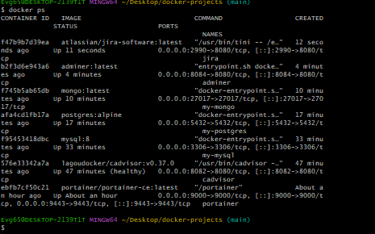
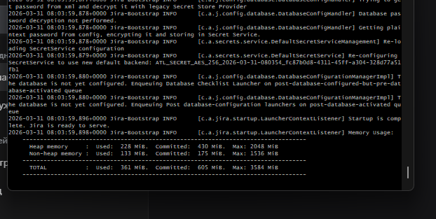
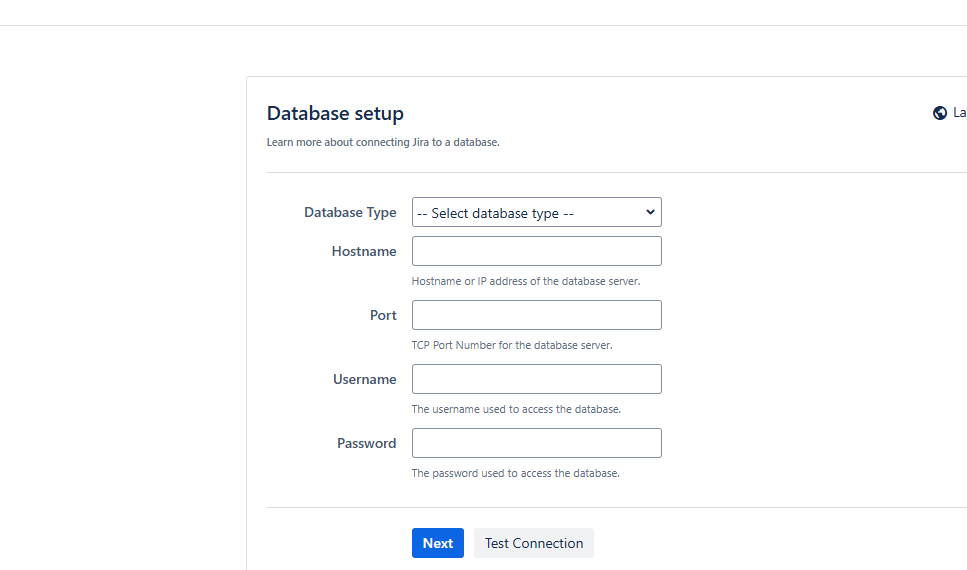

# Задание №10: Jira

## Цель работы
Запустить Jira (платформа для управления проектами и DevOps)

## Выполнение

### 1. Запуск контейнера
docker run -d --name jira -p 2990:8080 atlassian/jira-software:latest

text

### 2. Проверка работы
docker ps

text

### 3. Просмотр логов инициализации
docker logs -f jira

text
Инициализация занимает 5-10 минут.

### 4. Открытие в браузере
http://localhost:2990

## Возможности Jira

- Управление проектами и задачами
- Отслеживание ошибок (баг-трекинг)
- Scrum и Kanban доски
- Интеграция с DevOps инструментами

## Вывод
Jira запущена и доступна по адресу http://localhost:2990
📝 Обнови главный README.md
Добавь в таблицу:

markdown
| 10 | Jira | Платформа для управления проектами | [Jira.md](myNotes/Jira/README.md) |
🚀 Отправь на GitHub
bash
git add .
git commit -m "add Jira task"
git push
Пиши "погнали к одиннадцатому" 🚀

