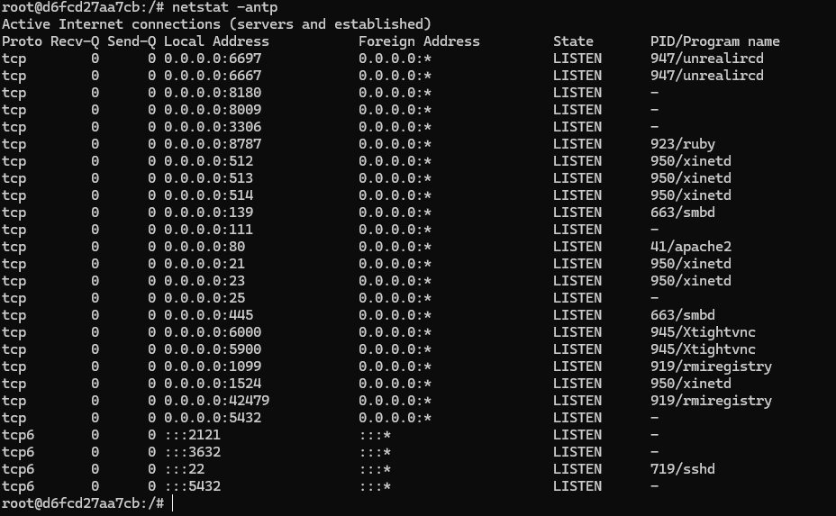

# Отчет: Развертывание уязвимой среды Metasploitable2

## 1. Запуск контейнера
Для тестирования безопасности был запущен контейнер в интерактивном режиме:
`docker run --name metasploitable2 -it tleemcjr/metasploitable2`

## 2. Анализ системы
Metasploitable2 содержит множество намеренно незащищенных сервисов. Проверка открытых портов внутри контейнера показала наличие активных служб FTP, Telnet, HTTP и других.

### Скриншот работающей системы:

## 3. Вывод
Среда успешно развернута. Данный образ является эффективным тренажером для отработки навыков системного администрирования и сетевой безопасности в изолированной среде Docker.