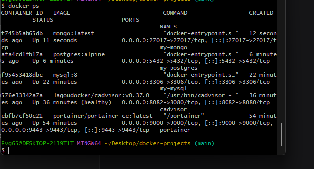
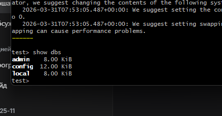
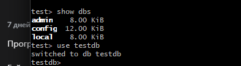
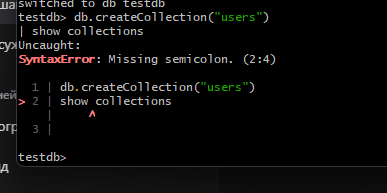
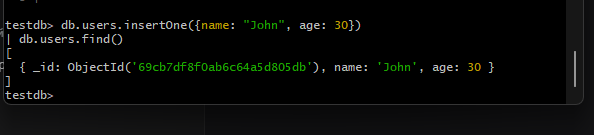

Отлично! Скриншоты на месте. Держи готовый код с правильными путями.

## 📄 Скопируй ЭТО полностью и вставь в `myNotes/MongoDB/README.md`:

```markdown
# Задание №8: MongoDB (NoSQL)

## Цель работы
Запустить MongoDB в Docker контейнере

## Выполнение

### 1. Запуск контейнера
```
docker run -d \
  --name my-mongo \
  -p 27017:27017 \
  mongo:latest
```

### 2. Проверка работы
```
docker ps
```



### 3. Подключение к MongoDB
```
docker exec -it my-mongo mongosh
```

### 4. Список баз данных
```javascript
show dbs
```



### 5. Переключение на базу данных
```javascript
use testdb
```



### 6. Создание коллекции
```javascript
db.createCollection("users")
show collections
```



### 7. Вставка и поиск данных
```javascript
db.users.insertOne({name: "John", age: 30})
db.users.find()
```



## Вывод
MongoDB запущена и доступна через порт 27017
```

## 🚀 Отправь на GitHub:

```bash
cd ~/Desktop/docker-projects
git add myNotes/MongoDB/README.md
git add screenshots/mongodb/
git commit -m "add MongoDB task with screenshots"
git push
```

---

**Пиши "погнали к девятому"** 🚀