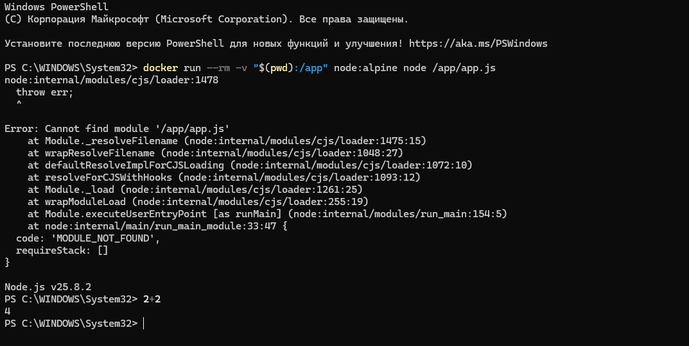

# Отчет: Запуск JavaScript через Node.js в Docker

## 1. Подготовка среды
Был создан файл `app.js` с базовой командой вывода в консоль.

## 2. Выполнение скрипта
Запуск производился на базе легковесного образа `node:alpine`. Использование томов позволило запустить локальный файл внутри изолированного контейнера:
`docker run --rm -v "$(pwd):/app" node:alpine node /app/app.js`

### Результат выполнения:

## 3. Интерактивный режим (REPL)
Был протестирован режим REPL (Read-Eval-Print Loop) для мгновенного исполнения JavaScript-кода в окружении Node.js.

## 4. Вывод
Node.js в Docker позволяет стандартизировать среду выполнения JavaScript для серверных приложений. Это гарантирует, что код будет работать одинаково на любой машине, где установлен Docker.