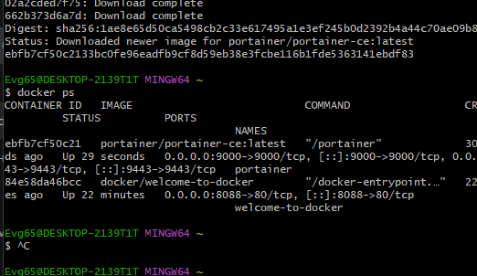
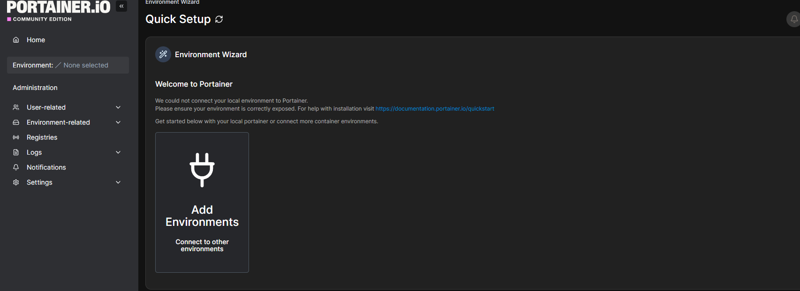
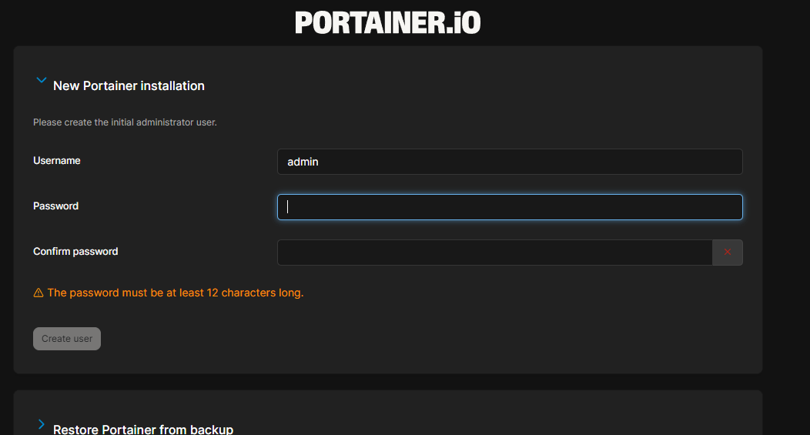
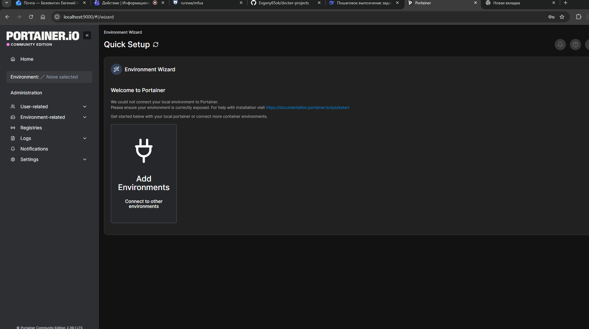

# Задание №3: Portainer

## Цель работы
Запустить Portainer (веб-интерфейс для управления Docker)

## Выполнение

### 1. Запуск контейнера
```
docker run -d \
  --name portainer \
  -p 9000:9000 \
  -p 9443:9443 \
  -v /var/run/docker.sock:/var/run/docker.sock \
  -v portainer_data:/data \
  --restart unless-stopped \
  portainer/portainer-ce:latest
```

### 2. Проверка работы
```
docker ps
```



### 3. Открытие в браузере
http://localhost:9000



### 4. Создание пароля администратора



### 5. Главный дашборд



## Возможности Portainer

- Управление контейнерами (запуск/остановка/удаление)
- Просмотр логов в реальном времени
- Терминал внутри контейнера
- Управление образами, сетями, томами
- Docker Compose стеки

## Вывод
Portainer запущен и доступен по адресу http://localhost:9000
```

Сохрани файл (Ctrl+S) и закрой блокнот.

## 📝 Обнови главный README.md

```cmd
notepad README.md
```

Добавь в таблицу третью строку:

```markdown
| 3 | Portainer | Веб-интерфейс для управления Docker | [Portainer.md](myNotes/Portainer/README.md) |
```

## 🚀 Отправь на GitHub

```cmd
cd C:\Users\Evg65\Desktop\docker-projects
git add .
git commit -m "add Portainer task with screenshots"
git push
```
