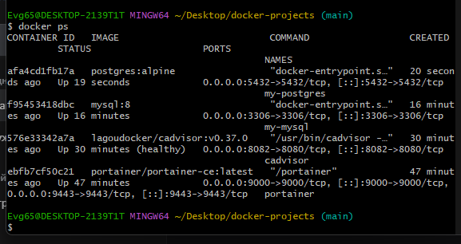
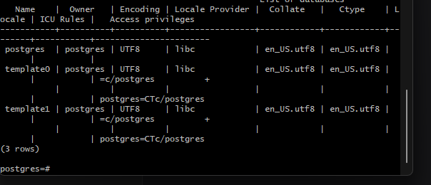
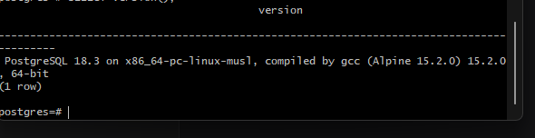
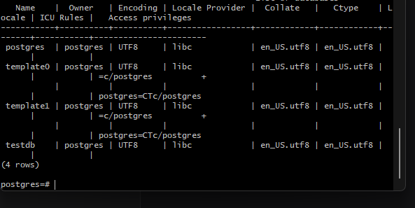

Отлично! Скриншоты на месте, имена правильные. Держи готовый код.

## 📄 Скопируй ЭТО полностью и вставь в `myNotes/PostgreSQL/README.md`:

```markdown
# Задание №7: PostgreSQL

## Цель работы
Запустить PostgreSQL в Docker контейнере

## Выполнение

### 1. Запуск контейнера
```
docker run -d \
  --name my-postgres \
  -p 5432:5432 \
  -e POSTGRES_PASSWORD=mysecretpassword \
  postgres:alpine
```

### 2. Проверка работы
```
docker ps
```



### 3. Подключение к PostgreSQL
```
docker exec -it my-postgres psql -U postgres
```

### 4. Список баз данных
```sql
\l
```



### 5. Версия PostgreSQL
```sql
SELECT version();
```



### 6. Создание базы данных
```sql
CREATE DATABASE testdb;
\l
```



## Вывод
PostgreSQL запущен и доступен через порт 5432
```

## 🚀 Отправь на GitHub:

```bash
cd ~/Desktop/docker-projects
git add myNotes/PostgreSQL/README.md
git add screenshots/postgresql/
git commit -m "add PostgreSQL task with screenshots"
git push
```

---

**Пиши "погнали к восьмому"** 🚀