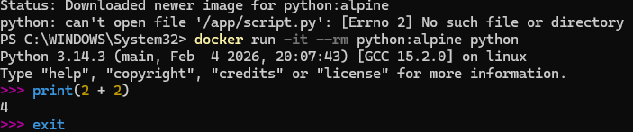

# Отчет: Запуск Python-скриптов в Docker

## 1. Подготовка скрипта
Был создан файл `script.py` с простым вызовом функции `print()`.

## 2. Выполнение кода
Запуск производился без установки Python на хост-машину, используя легковесный образ `python:alpine`:
`docker run --rm -v "$(pwd):/app" python:alpine python /app/script.py`

### Результат выполнения в терминале:

## 3. Интерактивный режим
Также протестирован интерактивный режим (REPL) для быстрой проверки команд Python в изолированной среде.

## 4. Вывод
Docker позволяет запускать Python-приложения любой сложности, обеспечивая идентичность среды выполнения на разных устройствах. Использование томов (Volumes) позволяет редактировать код в VS Code и сразу запускать его в контейнере.