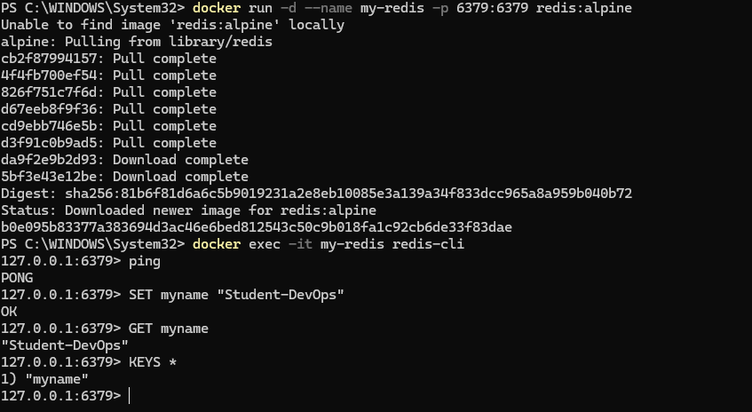

# Отчет: Развертывание In-memory БД Redis

## 1. Запуск контейнера
Redis запущен на порту 6379 с использованием оптимизированного образа Alpine:
`docker run -d --name my-redis -p 6379:6379 redis:alpine`

## 2. Работа с данными (Redis CLI)
Для взаимодействия с базой использовалась встроенная утилита командной строки.

### Основные операции:
- **Ping:** Получен ответ `PONG`, подтверждающий активность сервера.
- **SET/GET:** Успешно протестирована запись и чтение строковых значений по ключу.

### Скриншот работы в CLI:

## 3. Вывод
База данных Redis успешно развернута и готова к работе. Высокая скорость отклика в CLI подтверждает корректную работу движка в изолированном контейнере.