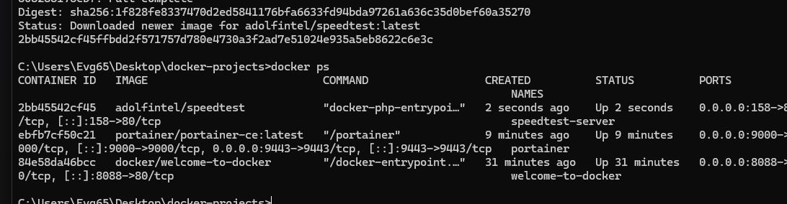
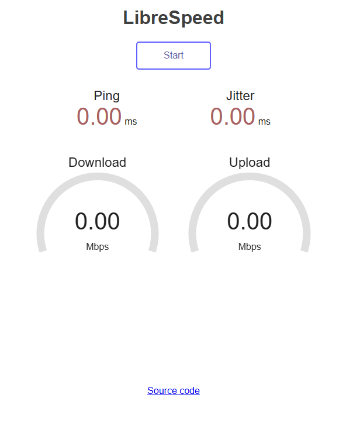
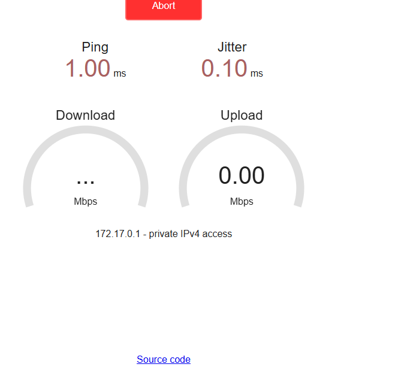
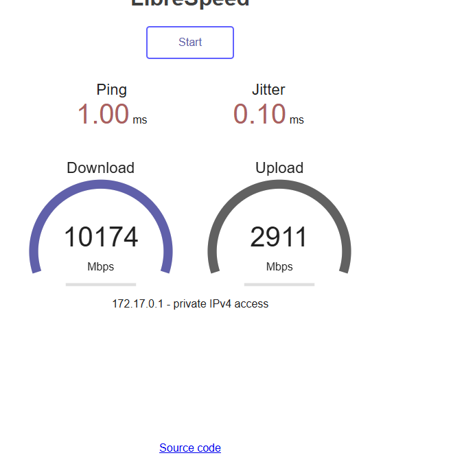

# Задание №4: Speedtest

## Цель работы
Запустить тест скорости интернета в Docker контейнере

## Выполнение

### 1. Запуск контейнера
```
docker run -d -p 158:80 --name speedtest-server adolfintel/speedtest
```

### 2. Проверка работы
```
docker ps
```



### 3. Открытие в браузере
http://localhost:158



### 4. Запуск теста скорости



### 5. Результат теста



## Возможности Speedtest

- Проверка скорости загрузки (Download)
- Проверка скорости отдачи (Upload)
- Измерение пинга (Ping)
- Веб-интерфейс для запуска тестов

## Вывод
Speedtest запущен и доступен по адресу http://localhost:158
```
