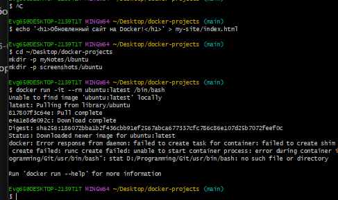
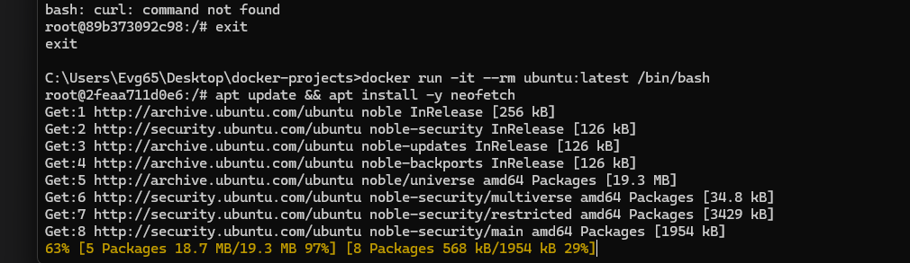
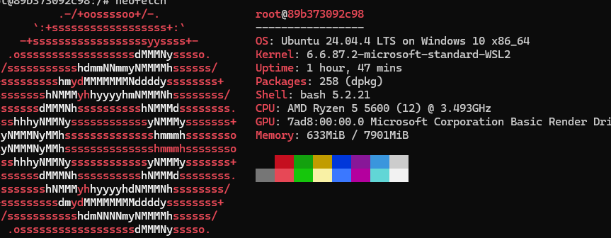
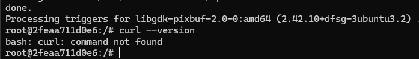

# Задание №13: Ubuntu для тестирования команд

## Цель работы
Запустить временный Ubuntu контейнер и выполнить базовые команды

## Выполнение

### 1. Запуск контейнера
```
docker run -it --rm ubuntu:latest /bin/bash
```



### 2. Обновление пакетов и установка neofetch
```
apt update && apt install -y neofetch
```



### 3. Запуск neofetch
```
neofetch
```



### 4. Проверка curl
```
curl --version
```



### 5. Выход
```
exit
```

## Вывод
Ubuntu контейнер успешно запущен, neofetch установлен и запущен

## Примечание
Контейнер удаляется автоматически после выхода (флаг --rm)
```

## 🚀 Отправь на GitHub:

```bash
cd ~/Desktop/docker-projects
git add myNotes/Ubuntu/README.md
git add screenshots/ubuntu/
git commit -m "add ubuntu task with screenshots"
git push
```

---

**Теперь ссылки правильные. Пиши "погнали к четырнадцатому"** 🚀