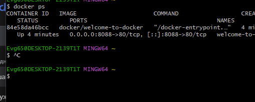
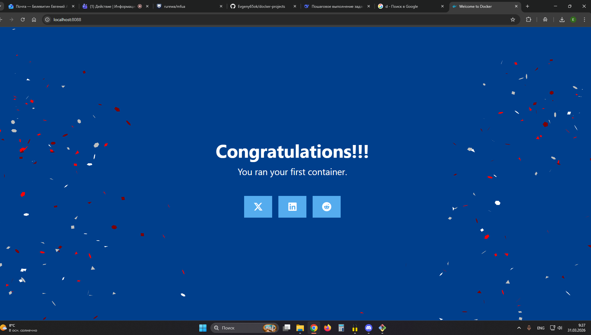
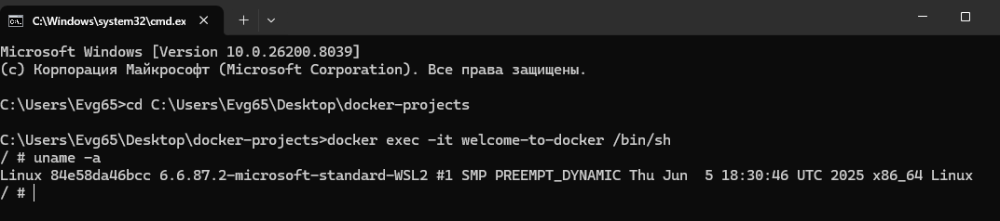
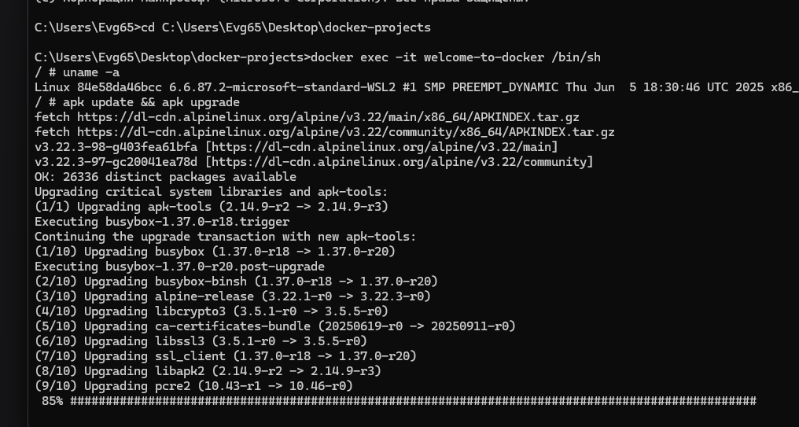
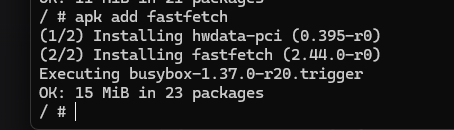
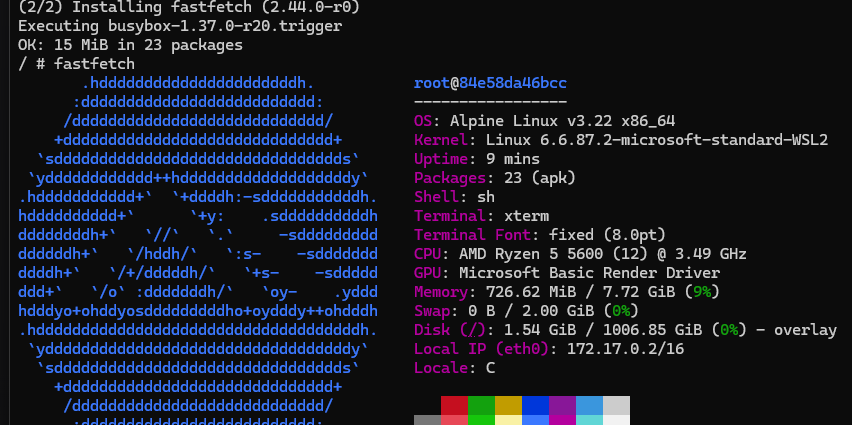

# Задание №2: Welcome to Docker

## Цель работы
Запустить демонстрационный контейнер docker/welcome-to-docker

## Выполнение

### 1. Запуск контейнера
```
docker run -d -p 8088:80 --name welcome-to-docker docker/welcome-to-docker
```

### 2. Проверка работы
```
docker ps
```



### 3. Веб-интерфейс
http://localhost:8088



### 4. Вход в контейнер
```
docker exec -it welcome-to-docker /bin/sh
```

### 5. Информация о системе
```
uname -a
```



### 6. Обновление пакетов
```
apk update && apk upgrade
```



### 7. Установка fastfetch
```
apk add fastfetch
```



### 8. Запуск fastfetch
```
fastfetch
```



### 9. Выход
```
exit
```

### 10. Остановка контейнера
```
docker stop welcome-to-docker
```

## Вывод
Задание выполнено. Контейнер запущен, порт проброшен, команды внутри отработали.
```

**Всё, копируй, вставляй, сохраняй, пуш на GitHub.**

**Пиши "погнали к третьему"** 🚀